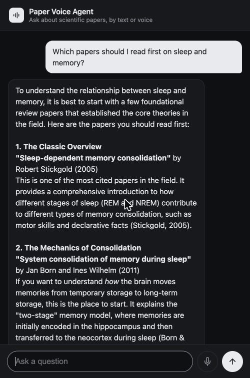

# Gemma Voice Agent

> **This branch is a temporary setup.** Cloud Run GPU quota is still pending on this new account
> (see [docs/gpu-quota-blocker.md](docs/gpu-quota-blocker.md)), so the brain/ears here are
> **Gemini via Vertex AI** for now, behind a swappable interface ([`app/model.py`](app/model.py)).
> The goal is unchanged: replace it with **self-hosted Gemma 4 on a Cloud Run L4 GPU** as soon as
> quota lands. Everything else (chat UI, paper tools, Kokoro voice) already works as designed.

A voice customer-service agent that is fully self-hosted: ask a question by voice, the agent
searches a knowledge base, and answers back in voice, with no external AI APIs. Built entirely on
open-weights models. **Your data, your infra, your control.**

The knowledge base in this demo is scientific papers, standing in for whatever *your* private data
source is: an internal database, docs, or search engine.

## Architecture

Everything runs in **one Google Cloud Run GPU service** (NVIDIA L4, scale-to-zero):

| Stage | Component |
|---|---|
| Voice in + understanding | **Gemma 4 E4B**, native audio input: transcription + intent in one call |
| Agent loop / tool use | Same Gemma instance, orchestrated with **ADK** |
| Knowledge lookup | OpenAlex paper search (stand-in for your in-infra data source) |
| Voice out | **Kokoro** (82M, CPU) |
| Frontend | Basic chat interface: type or talk, replies come back as text and voice |

## What it looks like

## Status

Early days. Building in the open, step by step:

- [x] Step 1: verify a GPU container runs on Cloud Run, see [`hello-gpu/`](hello-gpu/)
- [x] Web frontend: chat with both text and voice input, waveform playback bar for voice replies
- [x] Paper-lookup tool (OpenAlex) wired into the agent loop (ADK migration: [#1](https://github.com/delfinadap/gemma-voice-agent/issues/1))
- [x] Native audio input (voice note → answer), via Gemini for now
- [x] Kokoro voice out (CPU)
- [ ] Swap the interim Gemini brain for **Gemma 4 E4B on a Cloud Run L4 GPU** (blocked on
      [GPU quota](docs/gpu-quota-blocker.md))
