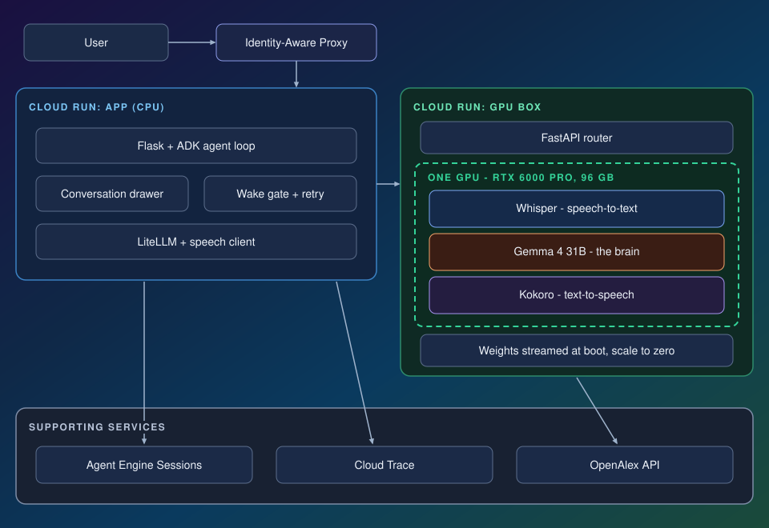
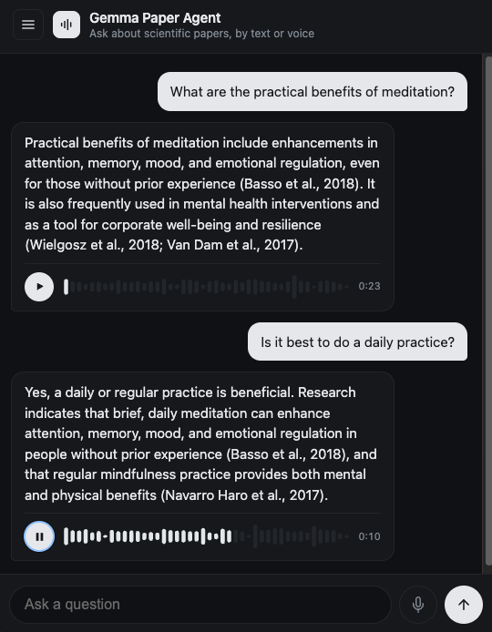

# Gemma Voice Agent

A voice customer-service agent that is fully self-hosted: ask a question by voice, the agent
searches a knowledge base, and answers back in voice, with no external AI APIs. Built entirely on
open-weights models. **Your data, your infra, your control.**

> **Fully self-hosted.** Speech-to-text (**Whisper** via vLLM), the brain (**Gemma 4 31B**
> via vLLM, orchestrated with ADK through LiteLLM), and text-to-speech (**Kokoro**) all run in one
> Cloud Run GPU service ([`gpu-speech/`](gpu-speech/)). Three open-weights models, no
> external AI APIs.

The knowledge base in this demo is scientific papers, standing in for whatever *your* private data
source is: an internal database, docs, or search engine.

## Architecture

Everything model-shaped runs on **one Cloud Run GPU service** (RTX 6000 Pro, scale-to-zero),
with a thin CPU service in front for the chat UI and agent loop:

| Stage | Component |
|---|---|
| Speech-to-text | **Whisper large-v3-turbo** (vLLM) |
| Agent loop / tool use | **Gemma 4 31B** (vLLM), orchestrated with **ADK** via LiteLLM |
| Knowledge lookup | OpenAlex paper search (stand-in for your in-infra data source) |
| Text-to-speech | **Kokoro** (82M) on the same GPU |
| Frontend | Basic chat interface: type or talk, replies come back as text and voice |

The GPU box sleeps when idle; the app detects that, wakes it on page load, and shows an
honest status (overlay on load, an in-stream event mid-conversation) while it boots.

## How it fits together

Two Cloud Run services with one seam between them:

- **The app** ([`app/`](app/)) is a small CPU service: the chat page, the ADK agent
  loop, and thin authenticated clients for the GPU box. A voice note is transcribed
  once (Whisper), the transcript fills your chat bubble and feeds the brain as text,
  and the reply is spoken on demand (Kokoro) after the text streams in. Conversations
  persist in Agent Engine Sessions, keyed per user; a failed turn surfaces an honest
  error and can be resumed from where it stopped (ADK invocation resume). Every turn
  emits OpenTelemetry spans to Cloud Trace.
- **The GPU box** ([`gpu-speech/`](gpu-speech/)) is where all three models live on one
  RTX 6000 Pro: two vLLM processes (Whisper, Gemma 4 31B) plus Kokoro inside the
  FastAPI router that owns the exposed port. It scales to zero; the big weights stream
  from a public GCS bucket at boot.
- **Tests** ([`test/`](test/), documented in [`test/testing.md`](test/testing.md)) run
  against any base URL, and the eval harness ([`eval/`](eval/)) judges the agent's
  behavior itself: tool usage and grounded answers, LLM-scored.

## Why ADK?

This project is simple enough that everything here could be hand-rolled: the
[GenAI SDK](https://googleapis.github.io/python-genai/) already makes direct model calls, tool
calls, and in-process conversation history easy. We use the
[Agent Development Kit](https://adk.dev/) for a few practical reasons. First, persistence:
with ADK, conversation history, state, and memory can live in storage we manage ourselves,
with backends swappable in a line, rather than only in the process or on the API's side.
Second, self-hosting: the GenAI SDK only speaks to
Google's hosted APIs, while ADK points the same agent at our own vLLM endpoint with a
one-line model config change. And for the road from prototype
to production, ADK has a convenient path forward for evaluation, observability, and error
recovery.

## Demo & screenshot

https://github.com/user-attachments/assets/ccdd3cf1-fd42-4b0a-8827-dd51140f795f

## Status

Early days. Building in the open, step by step:

- [x] Step 1: verify a GPU container runs on Cloud Run, see [`hello-gpu/`](hello-gpu/)
- [x] Web frontend: chat with both text and voice input, waveform playback bar for voice replies
- [x] Paper-lookup tool (OpenAlex) wired into the agent loop (ADK migration: [#1](https://github.com/delfinadap/gemma-voice-agent/issues/1))
- [x] Speech-to-text and text-to-speech self-hosted on a Cloud Run GPU: Whisper (vLLM) +
      Kokoro in [`gpu-speech/`](gpu-speech/), the app's only speech path
- [x] Interim Gemini brain swapped for **self-hosted Gemma 4 31B**, merged into the same
      GPU box as the speech models
- [x] Cold-start UX: wake-on-page-load, wake banner with server-anchored timer,
      in-stream waking events, retries
- [x] **Production layer**: persistent conversations (Agent Engine Sessions) with
      a drawer UI and per-conversation URLs, Google sign-in via IAP, error
      recovery with invocation resume, Cloud Trace observability, an LLM-judged
      eval harness, and a GCS cache for rendered speech

Writeup in progress: *From prototype to production: a self-hosted voice agent on
a single Cloud Run GPU*.
