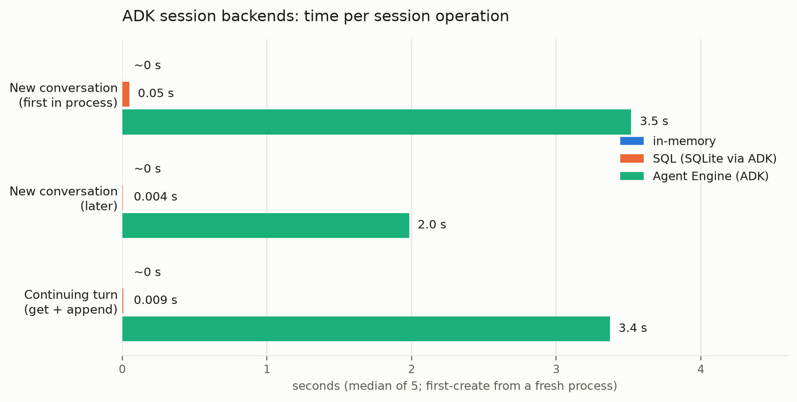

# Session backend benchmarks

How much time ADK session storage adds, compared across three backends through
the same `SessionService` interface.



## What was tested

`bench_session_backends.py` times the two paths a chat app takes, five rounds each:

- **New conversation**: `create_session` (the first create in a fresh process is
  reported separately - that's the slow one)
- **Continuing turn**: `get_session` + `append_event` (one turn's session work)

Backends: `InMemorySessionService`, `DatabaseSessionService` on local SQLite,
`VertexAiSessionService` (Agent Engine Sessions). No model is involved anywhere.

## Results (2026-08-14, google-adk 2.7.0, from a Mac outside us-central1)

| Backend | New (first in process) | New (later) | Continuing turn |
|---|---|---|---|
| in-memory | ~0 s | ~0 s | ~0 s |
| SQL (SQLite via ADK) | 0.05 s | 0.004 s | 0.009 s |
| Agent Engine (ADK) | 3.5 s | 2.0 s | 3.4 s |

First-create varied across fresh processes: 3.5 s, 3.5 s, 6.9 s on this day, and
15 s+ was observed on 2026-08-12 (google-adk 2.6.3). Creation is a long-running
operation the client polls, so its latency includes the polling schedule.
Numbers include the network round-trip to the us-central1 endpoint.

`bench_sessions.py` is the earlier, finer-grained script: it times each operation
individually and ends with a raw-REST probe of the same read (~0.16 s), which is
what showed the overhead lives in the client path rather than the API.

## Run it

```sh
cd app && GOOGLE_CLOUD_PROJECT=<project> AGENT_ENGINE_ID=<engine id> \
  uv run --with-requirements requirements.txt --with sqlalchemy --with aiosqlite \
  python ../test/bench_session_backends.py
```

The engine can be an empty Agent Engine resource - nothing deploys to it. Without
the two env vars, the Agent Engine leg is skipped and the local backends still run.

## Other files here

- `smoke.sh` - acceptance suite for the deployed app; `testing.md` explains all
  the test layers.
- `cold.sh` - cold-boot timing for the GPU box.
